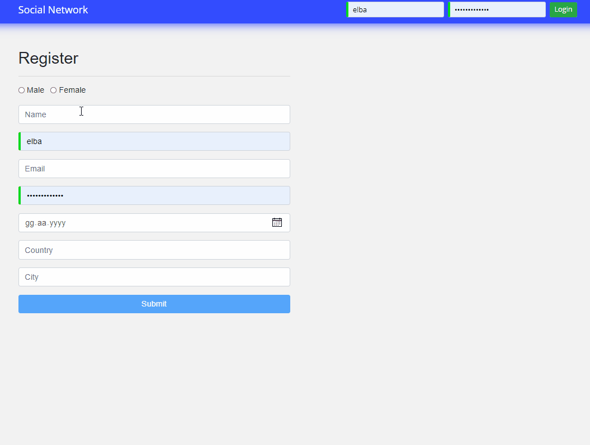
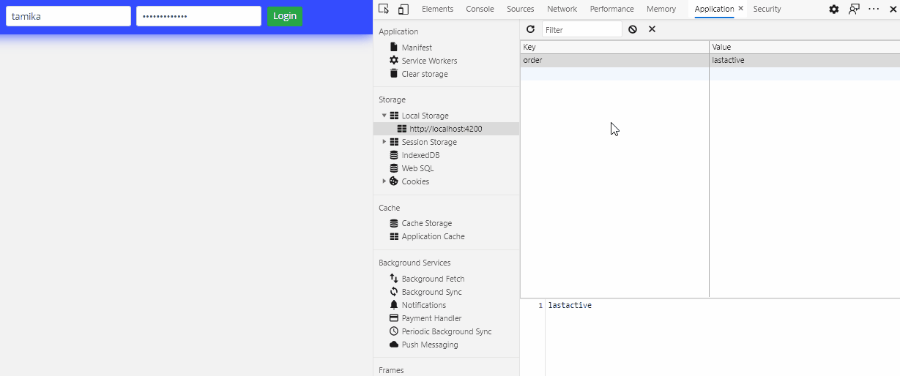
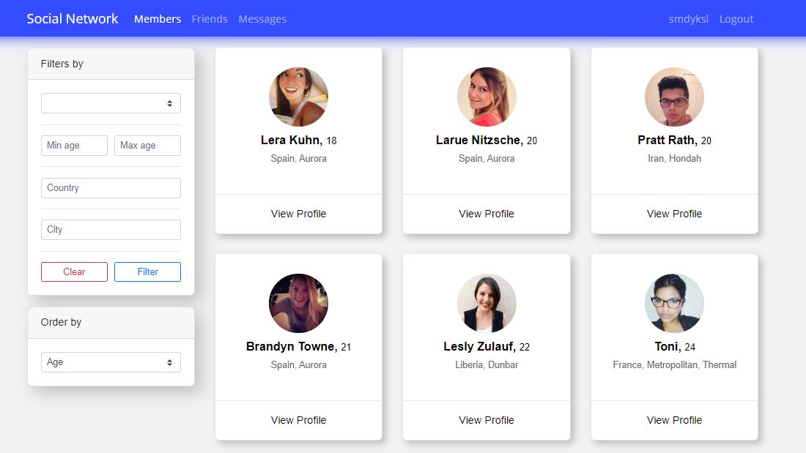
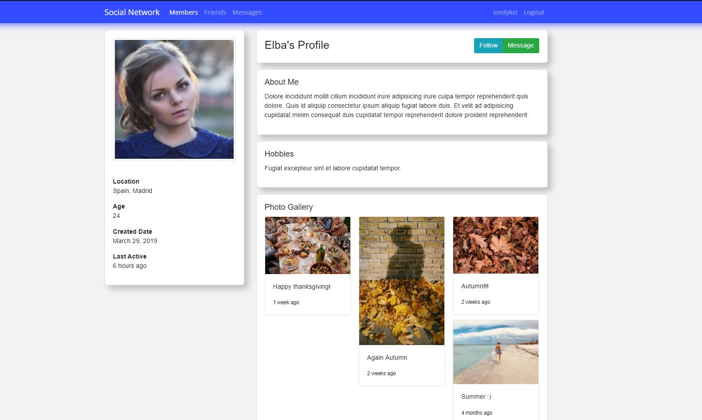
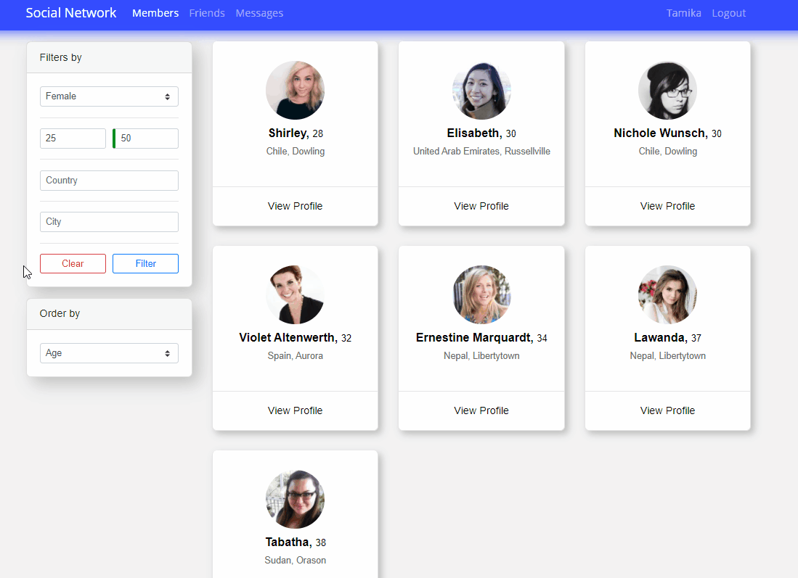
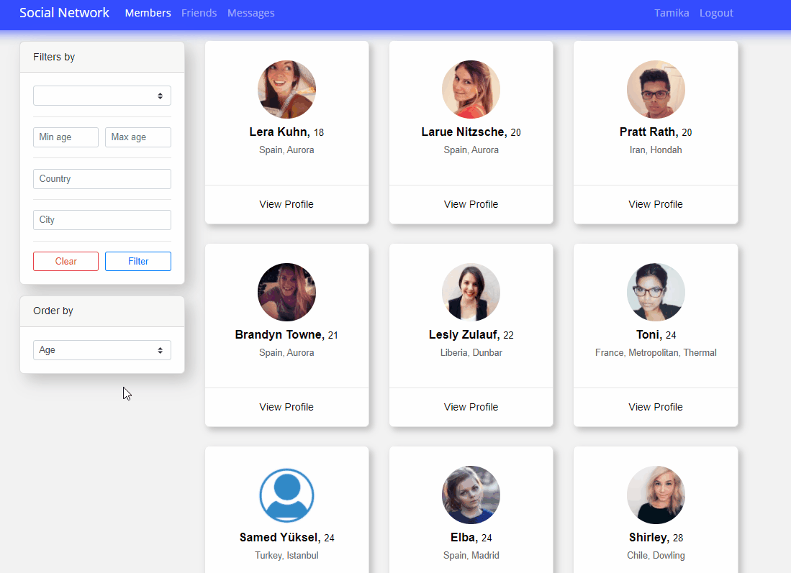

## Social Network Web Application

 I developed the backend side using .Net Core 3.1 and on the frontend I used Angular 9.

#### The Register Page.
 
 

#### This page is where all users are viewed after authorization.
 

#### This one is the user's detailed page
 
 

#### Filtering can be done from the left side.
 

#### You can order by age, creation date or last seen date.
 

 

